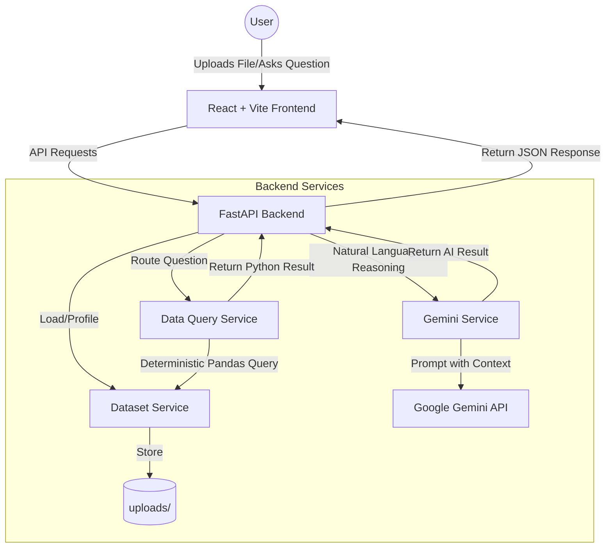

# DataChat MVP

A simple, working local MVP to chat with your CSV or Excel datasets using FastAPI, React, and Gemini AI.

## Project Architecture



## Detailed Tech Stack

### Frontend
- **Framework:** React 18
- **Build Tool:** Vite
- **Language:** TypeScript
- **Styling:** Tailwind CSS
- **API Client:** Axios
- **State Management:** React Hooks (useState/useEffect)

### Backend
- **Framework:** FastAPI
- **Web Server:** Uvicorn
- **Language:** Python 3.10+
- **Data Processing:** Pandas, NumPy
- **Excel Support:** Openpyxl
- **AI Integration:** Google GenAI SDK (`google-genai`)
- **Environment Management:** Pydantic Settings, Python-Dotenv
- **File Handling:** Pathlib, UUID, Shutil

## Project Structure

```text
backend/         # FastAPI server
frontend/        # React + Vite client
README.md        # This file
.gitignore
```

## Prerequisites

- [Python 3.10+](https://www.python.org/downloads/)
- [Node.js 18+](https://nodejs.org/)
- A Google Gemini API Key

## Local Setup (Windows PowerShell)

### 1. Backend Setup

Open a new PowerShell window:

```powershell
# Navigate to backend
cd backend

# Create Virtual Environment
python -m venv venv

# Activate Environment
.\venv\Scripts\Activate.ps1

# If you get an execution policy error, run:
# Set-ExecutionPolicy -Scope Process -ExecutionPolicy Bypass
# .\venv\Scripts\Activate.ps1

# Install Dependencies
pip install -r requirements.txt

# Configure Environment
# Open backend/.env and add your GEMINI_API_KEY
# Default model fallback logic will handle version mismatches automatically.

# Run Server
uvicorn app.main:app --reload
```

- **Backend URL:** [http://localhost:8000](http://localhost:8000)
- **API Docs:** [http://localhost:8000/docs](http://localhost:8000/docs)

### 2. Frontend Setup

Open a second PowerShell window:

```powershell
# Navigate to frontend
cd frontend

# Install Dependencies
npm install

# Run Dev Server
npm run dev
```

- **Frontend URL:** [http://localhost:5173](http://localhost:5173)

## Hybrid AI Architecture

1. **Upload:** Upload a `.csv` or `.xlsx` file. The backend profiles the data using Pandas to extract column names, types, and sample statistics.
2. **Persistence:** Files are stored in `backend/uploads/` and tracked via a registry.
3. **Deterministic First:** When you ask a question, the `Data Query Service` first attempts to answer using deterministic Pandas logic (e.g., averages, counts, distributions).
4. **AI Fallback:** If the query requires interpretation, reasoning, or narrative insights, the `Gemini Service` is invoked with a structured context of the dataset.
5. **Model Discovery:** The system automatically selects the best available Gemini model (Flash/Pro) based on your API key.

## Troubleshooting

- **Gemini 404/403 Errors:** Ensure your API key is valid and has not been reported as leaked.
- **File Upload Errors:** Ensure the file is not open in Excel while uploading.
- **CORS Issues:** If the frontend can't talk to the backend, verify `CORS_ORIGINS` in `backend/.env` matches your frontend URL.
