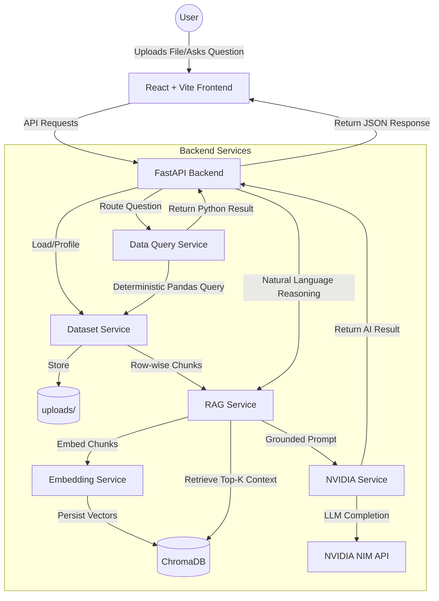

# DataChat RAG MVP

A powerful local MVP to chat with your CSV or Excel datasets using FastAPI, React, NVIDIA NIM, and RAG (Retrieval-Augmented Generation).

## Project Architecture



## Key RAG Features
- **Row-wise Chunking**: Each row in your dataset is treated as a separate retrievable document.
- **Local Embeddings**: Uses `sentence-transformers/all-MiniLM-L6-v2` for fast, local vector generation.
- **Vector Search**: Leverages **ChromaDB** for persistent, local storage and semantic retrieval.
- **Grounded AI**: The AI only answers based on the specific relevant rows retrieved from your data.

## Tech Stack

### Frontend
- **Framework:** React 18
- **Build Tool:** Vite
- **Styling:** Tailwind CSS

### Backend
- **Framework:** FastAPI
- **Data Processing:** Pandas
- **Vector DB:** ChromaDB
- **Embeddings:** Sentence-Transformers (local)
- **AI Integration:** NVIDIA NIM API (Llama 3.3)

## Prerequisites
- [Python 3.10+](https://www.python.org/downloads/)
- [Node.js 18+](https://nodejs.org/)
- An **NVIDIA API Key** (from NVIDIA Build/NIM)

## Local Setup (Windows PowerShell)

### 1. Backend Setup
```powershell
cd backend

# Create & Activate Virtual Environment
python -m venv venv
.\venv\Scripts\Activate.ps1

# Install Dependencies
pip install -r requirements.txt

# Configure Environment
# Rename .env.example to .env and add your NVIDIA_API_KEY
```

### 2. Frontend Setup
```powershell
cd frontend
npm install
npm run dev
```

## How It Works
1. **Upload**: When a file is uploaded, it is summarized and every row is embedded and stored in a local ChromaDB collection.
2. **Chat**:
   - The system first tries a **deterministic** answer using Pandas (for counts, sums, etc.).
   - If not found, it performs a **semantic search** in ChromaDB for the top 5 most relevant rows.
   - These rows are sent to the NVIDIA Llama 3.3 model as grounded context to generate a natural language answer.

## Storage
- **Uploads**: `backend/uploads/`
- **Vector Store**: `backend/chroma_store/`
